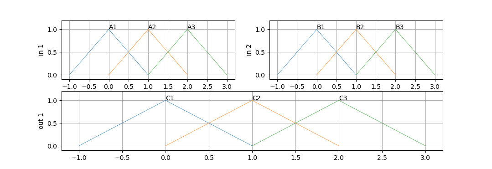
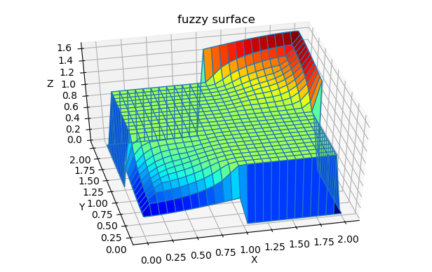
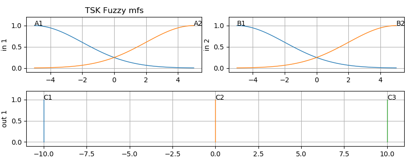
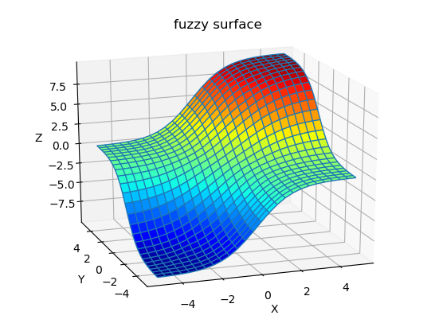

Tutorial
========

This simple tutorial shows how to create and configure 2-input, 1-output Fuzzy System:
| Mamdani System - in Example 1 
| TSK (Takagi-Sugeno-Kang) in Example 2       
 
.. contents:: Table of Contents
.. section-numbering::

--------------------------------
Examaple 1: Mamdani Fuzzy System 
--------------------------------

**Overview**
In this example we create default Mamdani system, configure FIS with triangular input and output membership functions 
and add some rule to explore properties of out Fuzzy system.

Code for this example You will find in package code in: ffs/examples/example_1_mamdani.py (https://github.com/2dof/ffs/tree/master/ffs)

**Imort lib**

.. code-block:: python
    
    import numpy as np 
    from fuzzy import *
    from fuzzy_sets import * 

**Creating Mamdani Fuzzy System**

Lets create Mamdani Fuzzy System with 2 inputs and 1 output and default settings:
| OR method: 'max' , AND method: 'min'
| Implication method:  'min'  (minimum)
| Aggregation Method:  'max'  (maximum)   
| Defuzzyfication Method: 'centroid' (center of gravity)

Imputs and outputs name and ranges:  
| input 1 named 'x1' and varianle range from 0 to 2.0
| input 2 named 'x2' and varianle range from 0 to 2.0 
| output  named 'y1' and varianle range from 0 to 2.0

.. code-block:: python

      fis1=fism('mamdani')
       
      # add inputs and outputs to fizzy
      fis1.addvar('in','x1',[0.,2.0])
      fis1.addvar('in','x2',[0.,2.0])
      fis1.addvar('out','y1',[0.,2.0])

For each inputs and otput we add 3 mfs trangular membership functions: 

.. code-block:: python

      fis1.addmf('in',1,'A1','trimf',[-1,0,1,0])
      fis1.addmf('in',1,'A2','trimf',[0,1,2,0])
      fis1.addmf('in',1,'A3','trimf',[1,2,3,0])
      
      fis1.addmf('in',2,'B1','trimf',[-1,0,1,0])
      fis1.addmf('in',2,'B2','trimf',[0,1,2,0])
      fis1.addmf('in',2,'B3','trimf',[1,2,3,0])
      
      fis1.addmf('out',1,'C1','trimf',[-1,0,1,0])
      fis1.addmf('out',1,'C2','trimf',[0,1,2,0])
      fis1.addmf('out',1,'C3','trimf',[1,2,3,0])

Lets plot membership functions of fis1 system.   
First lets import dedicated plot function from plot_fis class then
plot mfs:

.. code-block:: python

      from plot_fis import plot_mfs  
      
      figure(1)
      subplot(221);  cla()
      plot_mfs(fis1,'in',1)  
      subplot(222);  cla()
      plot_mfs(fis1,'in',2)      
      subplot(212);  cla()      
      plot_mfs(fis1,'out',1)  

**Adding Rules**

Rule is added as coded list of integers of length (N_inpust+ Noutputs +1]
 
for example:
Rule: If x1 is A1 AND x2 B2 then output is  C3  
| coded Rule : R=[1,  2, 3, 1]

| R[0]=1 means first  (A1) mf of input x1
| R[1]=2 means second (B2) mf of input x2
| R[2]=3 means third (C3) mf of  output 1
| R[3]=1 means AND operator,  for OR oerator will be 0 

For example: 

| if x1 is A2, then output is C1  -> [1, 0, 1, 1]  , zero means there is no x2 in rule 
| if x2 is A1 OR x2 is B1 then output is C2  -> [1, 1, 2, 0]  

Lets add Rules to our fuzzy system 

.. code-block:: python

      R1=[1,1,1,1]            # Rule 1:  if x1 is A1 and x2 is B1 then y is C1   
      R2=[2,2,2,1]            # Rule 2:  if x1 is A2 and x2 is B2 then y is C2  
      R3=[3,3,3,1]            # Rule 3:  if x1 is A3 and x2 is B3 then y is C3  
      
      fis1.addrule(R1,1.0)        # add rules to the fis1 , weighting parameter  = 1.0
      fis1.addrule(R2,1.0)
      fis1.addrule(R3,1.0)

**Evaluate fuzzy system**

to test out system we need call   **evaluate(fis1,[x1, x2])** function, for example:

.. code-block:: python

      x1 = 0.5 
      x2 = 0.5
      y1 = evaluate(fis1,[x1, x2])
      print(f'fuzzy input:[{x1}, {x2}], y1 = {y1}')
 
where after printing we get:

.. code-block:: python    

    >> fuzzy input:[0.5, 0.5] y1 = [0.8759]
    
.. note::  
    We just add only 3 Rule which don't cover changes variable in input space,
    for example, there is no rule if x1 is A1 and x2 is B3 then y is .... do when 
    we put [x1,x2] =[0.5, 2] , from input x1 mfs: A1, A2 and from input x2 mfs
    B3  will be activated but none of Rules will be fired, in that case Fuzzy System
    will return value 0.0 and flag **NoRuleFired** will be set at 1.
    
    .. code-block:: python
     
      y1 = evaluate(fis1,[0.5, 2])          
      print ('test for no rule activated: evaluate(fis1,[0.5, 2]) =', y1)
      print('fis1.outOfRange =',fis1.NoRuleFired)
      
      >> test for no rule activated: evaluate(fis1,[0.5, 2]) = [0.0]
      >> fis1.NoRuleFired = 1

**Out od range inputs**

For input out of range od input variable fuzzy system will return [0.0] value, and
flag  **outOfRange** will be set on 1.

.. code-block:: python

  y1 = evaluate(fis1,[-0.5, -0.5])
  print ('test for inputts out of range: evaluate(fis1,[-0.5, -0.5]) =', y1)
  print('fis1.outOfRange :',fis1.outOfRange)

  >> test for no rule activated: evaluate(fis1,[-0.5, -0.5]) = [0.0]
  >> fis1.outOfRange : 1

.. note::  
  In upper example [x1,x2] =[-0.5, -0.5], are out of defined range for variables [0, 2],
  when wee look at mfs plots, it is clear that mfs A1 and B1 is activated but inputs 
  are out of range so Flag **outOfRange** will be set on 1 and output = 0.0 will be retured.
  
  We will get the same result if any of input will be out of range. 

**Plot Fuzzy Surface** 

Lets plot fuzzy surface for our Fuzzy system. First we have to import plotting python libraries:
mpl_toolkits and  matplotlib:  

.. code-block:: python

      # import plot library 
      from mpl_toolkits.mplot3d.axes3d import Axes3D 
      from matplotlib import cm

Then, just generate surface data  with getsurf(FIS,Npts)  where:
| FIS  : fis system
| Nopts: No of points for variable range to be calculated. 

Numpy meshgrin is called to generate mesh from X,Y vectors. 

.. code-block:: python
 
      # generatge surface data points 
      X,Y,Z=getsurf(fis1,25)           # X,Y - data vectors of lengths (25+1) each.
      X, Y = np.meshgrid(X, Y)         # do mesh grid from X,Y input data points
    
    
      # plot surfase
      fig = plt.figure(4)
      ax =  fig.gca(projection='3d')
      ax.plot_surface(X, Y, Z, cmap=cm.jet, rstride=1, cstride=1)
      ax.plot_wireframe(X, Y, Z, rstride=1, cstride=1)
      ax.set_xlabel('X')
      ax.set_ylabel('Y')
      ax.set_zlabel('Z')
      plt.title('fuzzy surface')

Because not all changes in input variables are covered by Rules (see notes above), there are
discontinuities from level Z=1.0 to 0 when none of Rules are activated.

Let fix this by adding some rules to our FIS. first add Rule 4 and 5, then check (by plotting surface)
what happen if rest of rules will be added. Play changing implication ("then") by 
changing No of output mfs.   

.. code-block:: python
     
    fis1.addrule([3, 1, 2, 1],1.0)       # Rule 4
    fis1.addrule([1, 3, 2, 1],1.0)       # Rule 5 
    #fis1.addrule([2, 1, 1, 1],1.0)       # Rule 6 
    #fis1.addrule([1, 2, 1, 1],1.0)       # Rule 7  
    #fis1.addrule([2, 3, 3, 1],1.0)       # Rule 8
    #fis1.addrule([3, 2, 3, 1],1.0)       # Rule 9

+-----------------------------------------+-----------------------------------------+ 
| .. figure:: images/mamdani_surf_a_2.png | .. figure:: images/mamdani_surf_a_3.png |
|   :width: 500                           |   :width: 500                           |
|   :align: left                          |   :align: right                         |
|                                         |                                         |
|   Rule 4 and 5 added                    |   Rest of rules added                   |   
+-----------------------------------------+-----------------------------------------+

**Changing defuzzyfication method and other parameters** 

Changing deffuzyfication method or other parameters is done just by changing 
attributes of fuzzy system.
For example defuzzyfication method :

.. code-block:: python
 
      fis1.Defuzzymethod = 'mom'     # or 'mom', 'som', 'lom', 'bisector'

For example changing 'AND' method :

.. code-block:: python
 
      #fis1.ANDmethod = 'eprod'              # AND method Tnorms: ,'min' ,'prod' , eprod'

Surfaces for changes FIS parameters:

+--------------------------------------------+----------------------------------------------+ 
| .. figure:: images/mamdani_surf_a_2mom.png | .. figure:: images/mamdani_surf_a_2eprod.png |
|   :width: 500                              |   :width: 500                                |
|   :align: left                             |   :align: right                              |  
|                                            |                                              |
|   5 rules FIS, deffuzyfication: 'mom'      |   5 rules FIS,  AND method: 'eprod'          |   
+--------------------------------------------+----------------------------------------------+
 
For more detail about attributes of fuzzy of fuzzy system read API documentation for **fism class**. 
   

----------------------------
Examaple 2: TSK Fuzzy System 
----------------------------

Code for this example You will find in package code in: ffs/examples/example_1_tsk.py (https://github.com/2dof/ffs/tree/master/ffs)

**Overview**
In this example TSK Fuzzy Model with singleton (constant) output membership functions will be tested.

Lets create 2 input ('x1', 'x2') and 1 output (y2) Sugeno fuzzy model with prarameters:

| input x1, range:[-5,5], mf A1: gaussian: :math:`c1 =-5`, :math:`\sigma_{1}=3`, mf A2: gaussian: :math:`c2 =5`, :math:`\sigma_{2}=3`
| input x2, range:[-5,5], mf B1: gaussian: :math:`c1 =-5`, :math:`\sigma_{1}=3`, mf B2: gaussian: :math:`c2 =5`, :math:`\sigma_{2}=3`
| output y2, range:[-10,10],  singletone mf: C1=-10.0, C2=0.0 , C3= 10.0 

**Imort library**

Command sys.path.append("..") include upped folder (with fuzzy lib) to the path, we run example
from subfolder examples in main library directory.

.. code-block:: python

    import sys                           
    sys.path.append("..")          
    from fuzzy import *
    from fuzzy_sets import * 
    from plot_fis import plot_mfs  
    
    
**Design TSK Fuzzy system**

.. code-block:: python

    fis2=fism(type='tsk')
    
    #=============Add variabble====================
    fis2.addvar('in','x1',[-5.,5.])
    fis2.addvar('in','x2',[-5.,5.])
    fis2.addvar('out','y1',[-10.,10.0])
    # input 1
    fis2.addmf('in',1,'A1','gaussmf',[3,-5,0,0])   # [sigma , center of gaussian function]
    fis2.addmf('in',1,'A2','gaussmf',[3,5,0,0])
    # input 2
    fis2.addmf('in',2,'B1','gaussmf',[3,-5,0,0])
    fis2.addmf('in',2,'B2','gaussmf',[3,5,0,0])
     
    # output 
    fis2.addmf('out',1,'C1','singleton',[-10,0,0,0])
    fis2.addmf('out',1,'C2','singleton',[0,0,0,0])
    fis2.addmf('out',1,'C3','singleton',[10,0,0,0])

To plot MFS just call  plot_mfs(...): 

.. code-block:: python

    figure(1);
    subplot(221);  cla(); plot_mfs(fis2,'in',1)  ; plt.title('TSK Fuzzy mfs')
    subplot(222);  cla(); plot_mfs(fis2,'in',2)      
    subplot(212);  cla();plot_mfs(fis2,'out',1)  

   

**Add Rules**

After defining inputs and membership function we can add 4 Rules:

.. code-block:: python

    R1=[1, 1, 1, 1]         # If x1 is A1 and x2 is B1 then y is C1
    R2=[1, 2, 2, 1]         # If x1 is A2 and x2 is B2 then y is C2            
    R3=[2, 1, 2, 1]         # If x1 is A1 and x2 is B1 then y is C2
    R4=[2, 2, 3, 1]         # If x1 is A2 and x2 is B2 then y is C3
    
    fis2.addrule(R1,1.)
    fis2.addrule(R2,1.)
    fis2.addrule(R3,1.)
    fis2.addrule(R4,1.)

 
Now lets plot fuzzy surface:

.. code-block:: python
    
    X,Y,Z=getsurf(fis2,25)
    X, Y = np.meshgrid(X, Y)

    #  plot surface
    fig = plt.figure(2)
    ax =  fig.gca(projection='3d')
    ax.plot_surface(X, Y, Z, cmap=cm.jet, rstride=1, cstride=1,alpha=1,shade=False)
    ax.plot_wireframe(X, Y, Z, rstride=1, cstride=1 )
    plt.show()
    ax.set_xlabel('X')
    ax.set_ylabel('Y')
    ax.set_zlabel('Z')
    plt.title('fuzzy tsk surface')

   
**Changing memnership parameters**

Let change of gauusian :math:`\sigma` parameters for all inputs mfs. 
calling method fis2.setmf(...), and plot mmfs and surface.

.. code-block:: python

    fis2.setmf('in',1,1,'gaussmf',[2,-5,0,0])   # in 1 , mf 1 
    fis2.setmf('in',1,2,'gaussmf',[2,5,0,0])    # in 1 , mf 2  
    fis2.setmf('in',2,1,'gaussmf',[2,-5,0,0])   # in 2 , mf 1
    fis2.setmf('in',2,2,'gaussmf',[2,5,0,0])    # in 2 , mf 2
    
    #...plot mfs ans surface....
    ...
    
+--------------------------------------------+----------------------------------------------+ 
| .. figure:: images/mf_plot_tsk2.png        | .. figure:: images/tsk_surf_a_2.png          |
|   :width: 500                              |   :width: 500                                |
|   :align: left                             |   :align: right                              |  
|                                            |                                              |
+--------------------------------------------+----------------------------------------------+    

